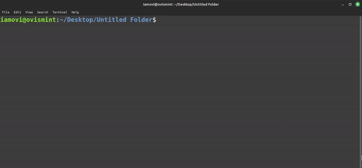

## yourcli

A cli template that let you create your own cli, this cli can be used to interact with your github repos -  open it in browser or clone it. ALso has some additional features.

### Here is step by step guide to create yourcli =>

> Note - before you create you cli, make sure you have installed nodejs and git on your machine.

**1 /**

Clone this repository,

```bash
git clone https://github.com/iamovi/yourcli.git
```

**2 /**

Open cloned project with your favorite code editor,

**3 /**

Install dependencies,

```bash
npm i
```

**4 /**

Before setting up, let's run it locally to see everything okay or not,

- open terminal and run - 
```bash
chmod +x index
```
- run next - 
```bash
./index
```
- if the Output - 
```bash
iamovi@ovismint:~/Desktop/yourcli$ ./index
? Choose a category: (Use arrow keys)
❯ projects 
  cli-tools 
  libraries 
  games 
  others 
  Exit 
```
- then everything is working buttery clean.

### Alright, let's move to next step - we will make the cli our own =>

> Note - please follow comments inside code files, you can see what you have to do.

Let's set up `package.json` file first -

- open `package.json` file,
- read comments section first from there,
```json
"name": "marufovi-cli",
```
- change the `name` to your desired name, Example `example-cli`
```json
  "description": "A CLI tool to intact with Maruf OVi's gh repos.",
```
- change description if needed,
```json
  "bin": {
    "marufovi": "./index"
  },
```
- change `marufovi` to your name, this command will be used to run your cli,
```json
  "keywords": [
    "marufovi",
    "web-dev",
    "marufovis-cli"
  ],
```
- change `keywords` if needed,
```json
  "author": "Maruf OVi",
```
- change `author` if needed.

We set up your `package.json` file, Lets move to next step,

Let's add your projects and repos to the cli - 

- open `repositories.js` file from `main` folder, `path - main/repositories.js`
- just follow those comments,
- by doing those your `repositories.js` is set up,

- okay now open `categories.js` file,
```javascript
// categories.js
export const categories = ['projects', 'cli-tools', 'libraries', 'games', 'others'];

// edit or add more catagories if needed
```
- you will see these code,
- just follow those comments as you did on `repositories.js` file.

Hmmm seems like your repos and your details are set to your cli, well done.

Now let's move to next step - 

- open `index` file, this is the main file of your cli
- you can see comments there too just follow those comments carefully
- but let me show you
```javascript
if (urlChoice.url === 'gmail') {
  console.log('Gmail: fornet.ovi@gmail.com'); // add your gmail here
```
- add your email here,
```javascript
if (actionChoice.action === 'Open') {
  shell.exec(`open https://github.com/your_username/${selectedRepository}`);
} else if (actionChoice.action === 'Clone') {
  const cloneUrl = `https://github.com/your_username/${selectedRepository}.git`;
  const cloneSuccess = shell.exec(`git clone ${cloneUrl}`).code === 0;
  // make sure to change you_username to your actual github username
```
- replace the `your_username` with your actual github account username,
- this will interact with your github repos to clone it or open it.

And yesss you did it (We did it!!!), your cli is read to BOOM 💥.

But it's always better to test locally first - 
```bash
./index
```
- run it and check your cli is working fine or need or check if anything needs to be changed.

#### Here is another way to test your cli locally

- open terminal in the project directory and run -

```bash
npm link
```

The `npm link` command is used in Node.js to create a symbolic link between a package and a local directory. This can be helpful during development when you want to test changes to a package in a real-world scenario without having to publish it to the npm registry.

- now run the command that you gave in `package.json` file.

```bash
  "bin": {
    "marufovi": "./index"
  },
```
- if it is `marufovi` then simply run `marufovi` in your terminal , the cli will run,
- after testing unlink cli
```bash
npm unlink marufovi
```
- replace `marufovi` with yours.

## Publish to npm

Congrats you made your cli, Let's publish it to npm so that anyone (you, your friends, others) can use use your cli to interact with you and with your gh repos,

- open terminal in your cli project directory,
```bash
npm login
```
- login your npm account, if you don't have then create one,

```bash
npm publish
```
- run this command to publish your cli to npm registry,
- now you can check your cli package in npm website.

## Installation of your cli

Let's install your cli in your machine =>

- open terminal
```bash
npm i -g your_cli
```
- replace `your_cli` with the name of your actual cli, that you gave it `package.json file
```json
  "name": "marufovi-cli",
```
- Once it installed globally in your machine,
- simply run your cli -
```json
  "bin": {
    "marufovi": "./index"
  },
```
- with the name that you gave here,
```bash
marufovi
```
- your cli will run!
- now choose actions and enjoy.

---

If you facing any problems during making your cli, feel free to contact with me 😊.

[Maruf OVi](https://oviportfo.netlify.app/)

fornet.ovi@gmail.com

## License
[MIT](LICENSE)